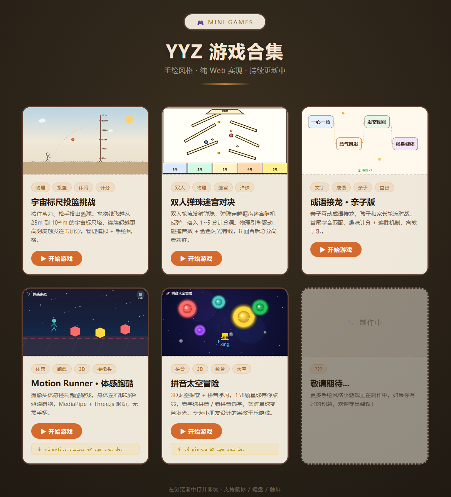

# YYZ 游戏合集

AI 生成的手绘风格小游戏合集，纯 Web 实现，浏览器打开即玩。



## 游戏列表

| 游戏 | 类型 | 说明 |
|------|------|------|
| 宇宙标尺投篮挑战 | 物理 / 休闲 | 按住蓄力投篮，抛物线飞越宇宙标尺塔，连击加分 |
| 双人弹珠迷宫对决 | 双人 / 物理 | 轮流发射弹珠穿越锯齿迷宫，8 回合后高分获胜 |
| 成语接龙 · 亲子版 | 文字 / 益智 | 亲子互动成语接龙，首尾字音匹配，寓教于乐 |
| Motion Runner · 体感跑酷 | 体感 / 3D 跑酷 | 摄像头体感控制，身体左右移动躲避障碍物 |
| 拼音太空冒险 | 3D / 教育 | 太空探索 + 拼音学习，答对题目点亮158颗星球 |

## 快速开始

### 方式一：直接打开

以下游戏无需安装，用浏览器打开对应 HTML 文件即可：

- `index.html` — 游戏合集首页（推荐入口）
- `cosmic_basketball.html` — 宇宙标尺投篮
- `pachinko_duel.html` — 双人弹珠对决
- `chengyujielong/index.html` — 成语接龙

从合集首页点击任意游戏卡片即可开始，按 **Esc** 返回合集。

### 方式二：启动后台服务

以下游戏需要先启动本地开发服务器：

**Motion Runner · 体感跑酷**（摄像头权限要求 localhost）：

```bash
cd motion-runner
npm install
npm run dev
# → http://localhost:3000
```

**拼音太空冒险**：

```bash
cd pinyin
npm install
npm run dev
# → http://localhost:3001
```

启动后在合集首页点击对应卡片即可进入。

## 系统要求

- 现代浏览器（Chrome / Edge / Firefox 最新版）
- Motion Runner 需要 **摄像头** 和 **Node.js 18+**
- 拼音太空冒险需要 **Node.js 18+**

## 项目结构

```
yyz_games/
├── index.html                # 游戏合集入口
├── cosmic_basketball.html    # 宇宙标尺投篮
├── pachinko_duel.html        # 双人弹珠对决
├── chengyujielong/
│   └── index.html            # 成语接龙
├── motion-runner/            # 体感跑酷 (Vite + Three.js)
│   ├── src/
│   ├── package.json
│   └── vite.config.ts
└── pinyin/                   # 拼音太空冒险 (Vite + Three.js)
    ├── src/
    ├── public/audio/         # 预生成中文发音 MP3
    ├── scripts/
    ├── package.json
    └── vite.config.js
```
